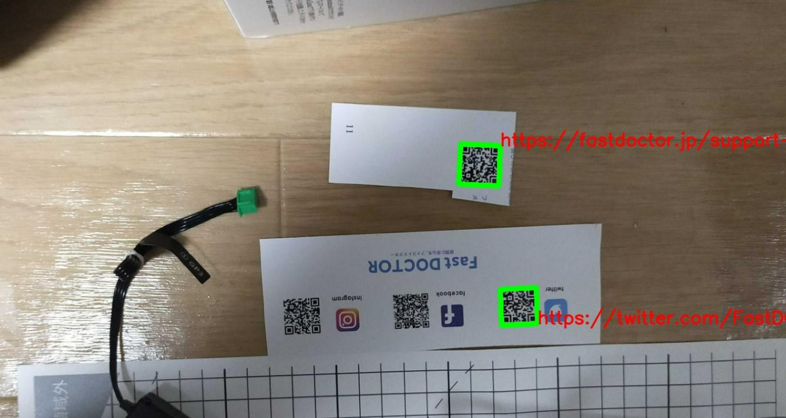
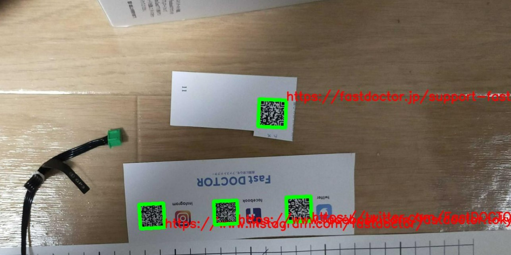

# QR code recognition
## More precise recognition of QR codes
- Use CNN
- Split images during recognition

## Comparison
- Normal
  - 
- This module
  - 

# Requirements
- Works on [WeChat QRCode](https://github.com/WeChatCV/opencv_3rdparty/tree/wechat_qrcode)
- pip install opencv-python
- pip install opencv-contrib-python

